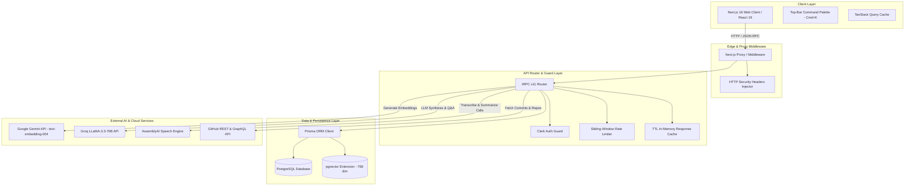
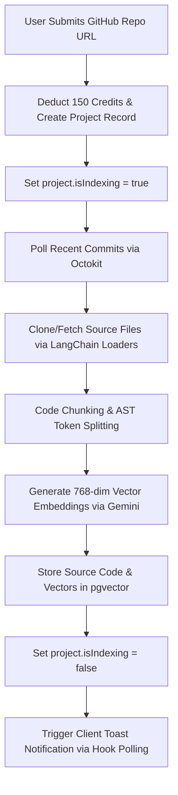
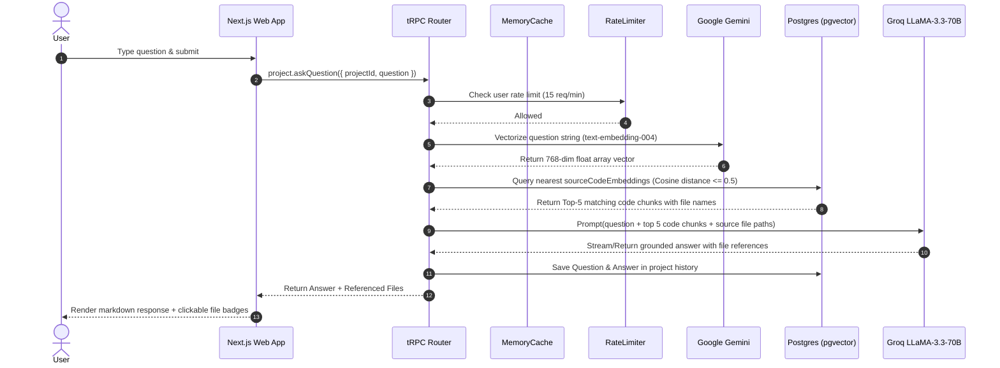
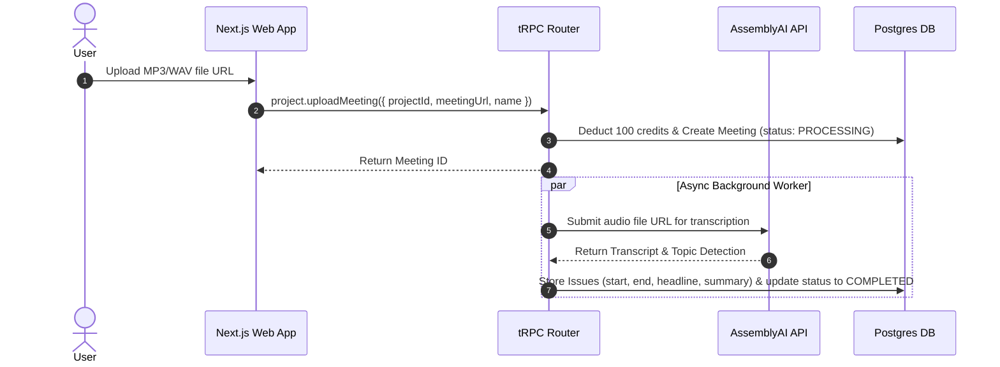
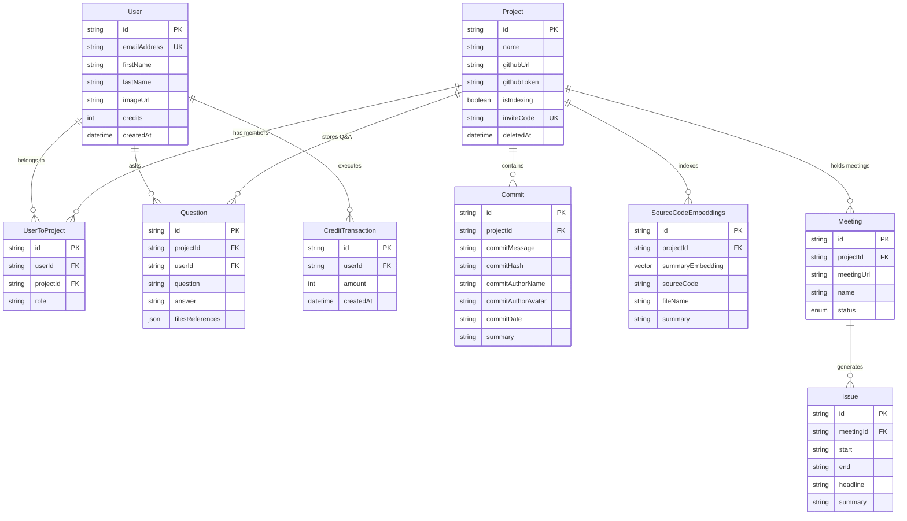

# 🏗️ Apex Architecture & Technical System Design

This document details the architectural blueprint, data flows, security posture, and subsystem designs behind **Apex** — a modern GitHub Repository Intelligence and Retrieval-Augmented Generation (RAG) platform.

---

## 📌 Executive Architecture Summary

Apex is designed around three core pillars:
1. **Low-Latency Repository Context Ingestion**: Code parsing, AST chunking, vector embedding generation, and fast similarity retrieval using PostgreSQL `pgvector`.
2. **Multi-Modal Project Intelligence**: Unifying source code vectors, Git commit histories, and meeting audio transcriptions into a coherent workspace.
3. **Defense-in-Depth & Scalability**: Zero-trust authentication via Clerk, sliding-window rate-limiting, TTL server-side caching, and granular credit metering.

---

## 🏛️ System Architecture Backbone



---

## 🔄 Core Subsystem Flows

### 1. Repository Indexing & Vectorization Pipeline

When a user links a GitHub repository, Apex triggers an asynchronous background ingestion pipeline.



### 2. RAG & Semantic Vector Search Flow

When a user asks a question about their codebase, Apex performs cosine similarity vector search over `pgvector` chunks before passing the context to the LLM.



### 3. Audio & Meeting Intelligence Flow

Apex converts team meeting recordings into project issues and transcripts.



---

## 🔒 Security Architecture & Defensive Posture

Apex incorporates multiple layers of security defenses to safeguard data and prevent API abuse:

```
+-----------------------------------------------------------------------+
|                         Next.js Edge Middleware                       |
|  - Strict Security Headers (HSTS, CSP, X-Frame-Options, Nosniff)     |
|  - Public vs Protected Route Isolation                               |
+-----------------------------------------------------------------------+
                                   |
                                   v
+-----------------------------------------------------------------------+
|                        Clerk Authentication Guard                     |
|  - JWT Session Verification & Fast-Path Local User Verification      |
+-----------------------------------------------------------------------+
                                   |
                                   v
+-----------------------------------------------------------------------+
|                    Sliding-Window Rate Limiter                        |
|  - 15 req/min on mutations (indexing, Q&A, meetings)                 |
|  - 120 req/min on queries                                             |
|  - Keyed by user ID (authenticated) or IP address (unauthenticated)   |
+-----------------------------------------------------------------------+
                                   |
                                   v
+-----------------------------------------------------------------------+
|                      Zod Input Sanitization                           |
|  - Strict payload size limits (.max()), trim(), URL validation        |
+-----------------------------------------------------------------------+
```

---

## ⚡ Performance & Caching Architecture

To achieve low latency and minimize database pressure, Apex uses a **Two-Tier Caching Architecture**:

1. **Client-Side Tier (TanStack Query)**:
   - Automatic background refetching and window focus synchronization.
   - Dynamic refetch interval (polling every 3s) when active project `isIndexing === true`, automatically halting once indexing finishes.

2. **Server-Side Tier (`MemoryCache`)**:
   - High-performance in-memory cache with configurable TTL (Time-To-Live).
   - `getProjects`: Cached for 30s per user.
   - `getTeamMembers`: Cached for 60s per project.
   - `getProjectByInviteCode`: Cached for 5m.
   - **Pattern-Based Invalidation**: Any state-changing mutation (`createProject`, `deleteProject`, `joinProject`, `leaveProject`, `syncProject`) immediately invalidates affected cache keys.

---

## 🗄️ Database Entity Relationship Diagram (ERD)



---

## 📊 Summary of Architectural Highlights

| Subsystem | Technology | Purpose / Benefit |
| :--- | :--- | :--- |
| **Vector DB** | PostgreSQL + `pgvector` | Native relational + vector storage (768-dim embeddings) |
| **API Layer** | tRPC v11 + Zod | End-to-end type safety with client-side inference |
| **Rate Limiter** | In-Memory Sliding Window | Prevents API spam, DDOS, and LLM credit exhaustion |
| **Cache Engine** | In-Memory MemoryCache | Sub-5ms response times for frequent project read queries |
| **Auth Engine** | Clerk Auth | Secure multi-tenant authentication with seamless session tokens |
