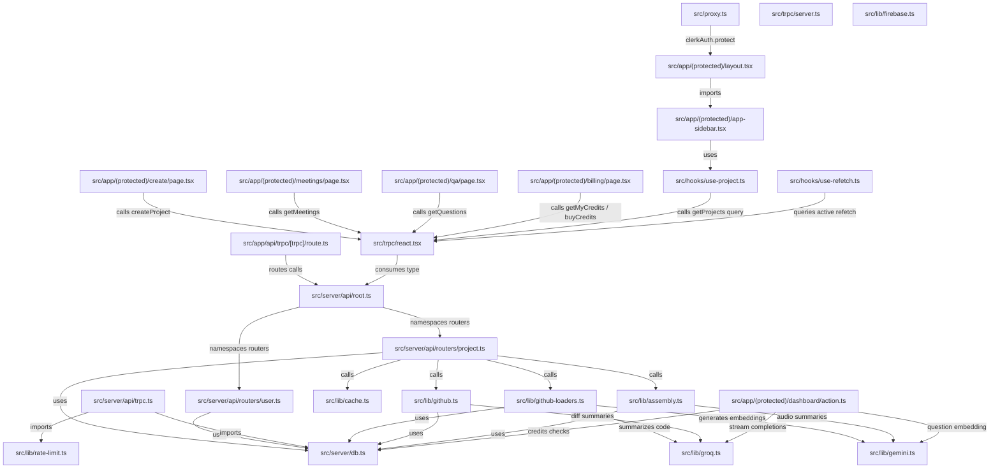
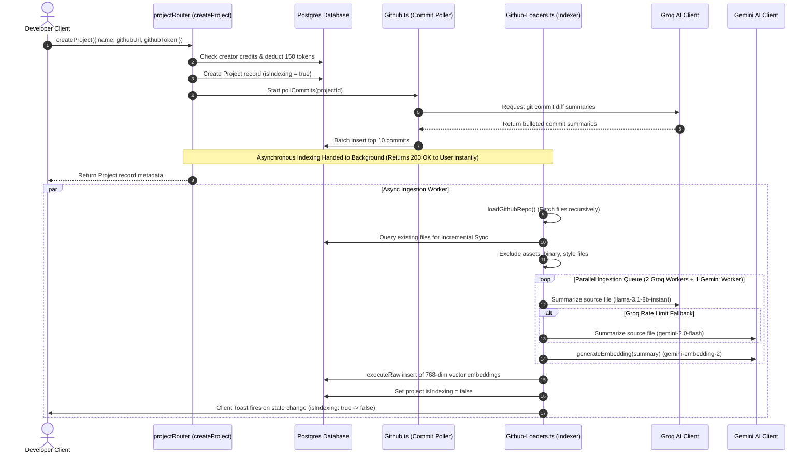
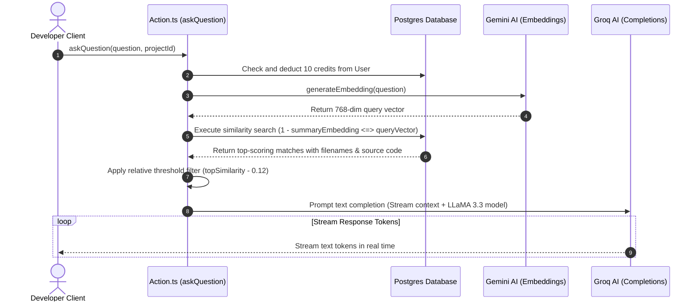

# 🗺️ Apex System Flow & File Connections Diagram

This document maps out the internal structural relationships and sequential runtime pipelines of **Apex** using Mermaid flowcharts and graph models.

---

## 🏛️ 1. File Dependency & Connection Graph

The following graph maps how files in the codebase import, trigger, or depend on one another.

---

## 🔄 2. Core Operational Sequence Pipelines

### A. Repository Creation & Indexing Flow

When a user links a new repository inside `create/page.tsx`, this pipeline coordinates database setups, token validation, commit scraping, and parallel AI parsing.

---

## 💬 3. Semantic RAG Q&A Execution Flow

