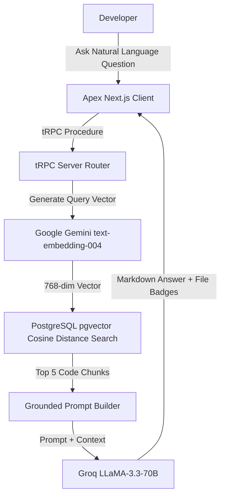

# 📖 Apex Developer Textbook & Comprehensive Learning Journal

Welcome to the **Apex Technical Masterclass & Learning Journal**. This document is an exhaustive, textbook-grade guide detailing the complete engineering, architecture, patterns, code snippets, and design choices behind the **Apex GitHub Repository Intelligence & RAG Platform**.

---

## 📋 Table of Contents
1. [Chapter 1: System Philosophy & High-Level Architecture](#chapter-1-system-philosophy--high-level-architecture)
2. [Chapter 2: Database Schema & PostgreSQL Vector Storage (`pgvector`)](#chapter-2-database-schema--postgresql-vector-storage-pgvector)
3. [Chapter 3: Dual-Worker Ingestion & Incremental Indexing Engine](#chapter-3-dual-worker-ingestion--incremental-indexing-engine)
4. [Chapter 4: Grounded Codebase RAG & Semantic Vector Search](#chapter-4-grounded-codebase-rag--semantic-vector-search)
5. [Chapter 5: Git Commit Intelligence & Diff Summarization](#chapter-5-git-commit-intelligence--diff-summarization)
6. [Chapter 6: Audio Speech-to-Text & Meeting Intelligence Pipeline](#chapter-6-audio-speech-to-text--meeting-intelligence-pipeline)
7. [Chapter 7: Top-Bar Command Palette (`⌘K`) & Active Project Hook](#chapter-7-top-bar-command-palette-k--active-project-hook)
8. [Chapter 8: Enterprise Security, Rate Limiting & Defense-in-Depth](#chapter-8-enterprise-security-rate-limiting--defense-in-depth)
9. [Chapter 9: Multi-Tier Caching Architecture & Cache Invalidation](#chapter-9-multi-tier-caching-architecture--cache-invalidation)
10. [Chapter 10: Step-by-Step Developer Setup & Implementation Cheat Sheet](#chapter-10-step-by-step-developer-setup--implementation-cheat-sheet)

---

## Chapter 1: System Philosophy & High-Level Architecture

### The Problem
Traditional code navigation relies on exact keyword string matching (e.g. `grep` or IDE search). When developers join a large project or attempt to understand unfamiliar code paths, keyword search fails because:
1. Developers don't know the exact symbol names or file names.
2. Code semantics (what the function *does*) are detached from syntax (how the function is *named*).
3. Context is fragmented across code, Git commits, and meeting recordings.

### The Solution: Apex Memory Layer
Apex bridges syntax and semantics by creating a **Unified Multi-Modal Memory Layer** over any GitHub repository:
- **Code Vectors**: High-dimensional semantic embeddings (768 dimensions) generated via `@google/genai`.
- **Commit History**: Automated LLM summarization of Git diffs via Groq `LLaMA-3.3-70B`.
- **Meeting Audio**: Automated transcription and topic issue extraction via AssemblyAI.
- **RAG Question Answering**: Grounded responses backed by exact, clickable source code file references.



---

## Chapter 2: Database Schema & PostgreSQL Vector Storage (`pgvector`)

### 1. Enabling PostgreSQL Vector Extensions in Prisma
Standard ORMs do not natively support vector datatype columns. To solve this in Prisma:
1. Enable `previewFeatures = ["postgresqlExtensions"]` in `prisma/schema.prisma`.
2. Add `extensions = [vector]` under `datasource db`.
3. Define vector columns as `Unsupported("vector(768)")`.

```prisma
// prisma/schema.prisma

generator client {
    provider        = "prisma-client-js"
    previewFeatures = ["postgresqlExtensions"]
    output          = "../generated/prisma"
}

datasource db {
    provider   = "postgresql"
    extensions = [vector]
}

model SourceCodeEmbeddings {
    id               String                      @id @default(cuid())
    summaryEmbedding Unsupported("vector(768)")?
    sourceCode       String
    fileName         String
    summary          String

    projectId String
    project   Project @relation(fields: [projectId], references: [id])

    @@index([projectId])
}
```

### 2. Inserting Vectors using Raw SQL (`$executeRaw`)
Because Prisma ORM cannot construct vector insertion objects, we construct raw SQL statements that cast float arrays to `::vector`:

```typescript
// Converting a float array to PostgreSQL vector literal: [0.123, -0.456, ...]
const embeddingStr = `[${embedding.embedding.join(",")}]`;

await db.$executeRaw`
    INSERT INTO "SourceCodeEmbeddings" (
        "id",
        "summaryEmbedding",
        "sourceCode",
        "fileName",
        "summary",
        "projectId"
    )
    VALUES (
        ${id},
        ${embeddingStr}::vector,
        ${embedding.sourceCode},
        ${embedding.fileName},
        ${embedding.summary},
        ${projectId}
    )
`;
```

> 💡 **Performance Note**: Using direct `INSERT` with `::vector` saves 50% database roundtrips compared to creating a record first and running a secondary raw `UPDATE`.

---

## Chapter 3: Dual-Worker Ingestion & Incremental Indexing Engine

### The Problem with Naive Repository Indexing
1. **API Rate Limit Crashes (HTTP 429)**: Firing parallel requests for 100+ files will instantly exceed OpenAI, Groq, or Gemini rate limits.
2. **Database Connection Exhaustion**: Unbounded parallel DB writes crash Prisma connection pools (typically capped at 10–20 connections).
3. **Redundant Processing**: Re-summarizing and re-embedding files that haven't changed wastes credits and time.

### Solution 1: Incremental File Ingestion
Before executing any LLM or embedding API calls, Apex compares existing DB records against the current repository tree:

```typescript
// src/lib/github-loaders.ts

// 1. Fetch existing file state from PostgreSQL
const existingEmbeddings = await db.sourceCodeEmbeddings.findMany({
    where: { projectId },
    select: { id: true, fileName: true, sourceCode: true }
});

const existingMap = new Map(existingEmbeddings.map(e => [e.fileName, e.sourceCode]));
const currentFileNameSet = new Set(filteredDocs.map(doc => doc.metadata.source || ''));

// 2. Separate unchanged files vs modified/new files
const docsToProcess: Document[] = [];
for (const doc of filteredDocs) {
    const fileName = doc.metadata.source || '';
    const existingSourceCode = existingMap.get(fileName);
    const currentSourceCode = doc.pageContent;

    if (existingSourceCode !== undefined && existingSourceCode === currentSourceCode) {
        // Skip API calls for unchanged files!
    } else {
        docsToProcess.push(doc);
    }
}

// 3. Purge deleted files from database
const deletedFileNames = existingEmbeddings
    .map(e => e.fileName)
    .filter(fileName => !currentFileNameSet.has(fileName));

if (deletedFileNames.length > 0) {
    await db.sourceCodeEmbeddings.deleteMany({
        where: { projectId, fileName: { in: deletedFileNames } }
    });
}
```

### Solution 2: Dual-Worker Parallel Queue Architecture
To maximize ingestion throughput without hitting vendor rate limits (RPM), Apex uses an **Atomic Claim Queue** across 2 Groq Workers and 1 Gemini Worker operating concurrently:

```typescript
// src/lib/github-loaders.ts

const generateEmbeddings = async (docs: Document[]) => {
    const results = new Array(docs.length).fill(null);
    let nextIndex = 0;

    // Atomic Queue Claiming
    const claimNextDoc = () => {
        if (nextIndex >= docs.length) return null;
        const idx = nextIndex++;
        return { doc: docs[idx]!, index: idx };
    };

    // Groq Worker (Allocated 2 workers, 400ms stagger)
    const groqWorker = async (workerId: number) => {
        while (true) {
            const item = claimNextDoc();
            if (!item) break;
            const { doc, index } = item;
            
            try {
                let summary = await summariseCodeGroq(doc);
                if (!summary) summary = await summariseCodeGemini(doc); // Fallback
                
                if (summary) {
                    const embedding = await generateEmbedding(summary);
                    results[index] = { summary, embedding, sourceCode: doc.pageContent, fileName: doc.metadata.source };
                }
            } catch (err) {
                console.error(`Worker error:`, err);
            }
            await new Promise(r => setTimeout(r, 400)); // Stagger next call
        }
    };

    // Gemini Worker (Allocated 1 worker, 1500ms stagger)
    const geminiWorker = async (workerId: number) => {
        while (true) {
            const item = claimNextDoc();
            if (!item) break;
            const { doc, index } = item;
            
            try {
                let summary = await summariseCodeGemini(doc);
                if (!summary) summary = await summariseCodeGroq(doc); // Fallback
                
                if (summary) {
                    const embedding = await generateEmbedding(summary);
                    results[index] = { summary, embedding, sourceCode: doc.pageContent, fileName: doc.metadata.source };
                }
            } catch (err) {
                console.error(`Worker error:`, err);
            }
            await new Promise(r => setTimeout(r, 1500)); // Stagger next call
        }
    };

    // Spawn 2 Groq workers & 1 Gemini worker in parallel
    await Promise.all([groqWorker(1), groqWorker(2), geminiWorker(1)]);
    return results.filter(Boolean);
};
```

---

## Chapter 4: Grounded Codebase RAG & Semantic Vector Search

### 1. Vector Distance Search Query
Apex uses PostgreSQL's Cosine Distance operator (`<=>`) to find the top 5 source code chunks closest to the user's question vector:

```typescript
// src/lib/gemini.ts

export async function askQuestion(question: string, projectId: string) {
    // Step 1: Convert user question into 768-dimensional vector
    const queryVector = await generateEmbedding(question);
    const queryVectorStr = `[${queryVector.join(",")}]`;

    // Step 2: Query pgvector for files with Cosine Distance < 0.5
    const result = await db.$queryRaw<Array<{ fileName: string; sourceCode: string; summary: string }>>`
        SELECT "fileName", "sourceCode", "summary",
               ("summaryEmbedding" <=> ${queryVectorStr}::vector) as distance
        FROM "SourceCodeEmbeddings"
        WHERE "projectId" = ${projectId} AND ("summaryEmbedding" <=> ${queryVectorStr}::vector) < 0.5
        ORDER BY distance ASC
        LIMIT 5;
    `;

    // Step 3: Construct Grounded Context
    let context = "";
    for (const doc of result) {
        context += `\n--- File: ${doc.fileName} ---\n${doc.sourceCode}\n`;
    }

    // Step 4: Generate LLM Response with System Guardrails
    const prompt = `You are an expert AI software engineer. Answer the user question using ONLY the provided code references:

CONTEXT:
${context}

QUESTION:
${question}

Provide a clear markdown response with file-level explanations.`;

    const answer = await generateAIAnswer(prompt);
    return { answer, filesReferences: result.map(r => ({ fileName: r.fileName })) };
}
```

---

## Chapter 5: Git Commit Intelligence & Diff Summarization

### 1. Polling Commits via Octokit (`src/lib/github.ts`)
Apex retrieves commit history and generates concise summaries for git diffs:

```typescript
// src/lib/github.ts

export const pollCommits = async (projectId: string) => {
    const { githubUrl } = await fetchProjectGithubUrl(projectId);
    const commitHashes = await getCommitHashes(githubUrl);
    
    // Filter out already processed commits
    const unProcesssedCommits = await filterUnProcesssedCommits(projectId, commitHashes);
    if (unProcesssedCommits.length === 0) return [];

    // Summarize diffs concurrently
    const summaries = await Promise.allSettled(unProcesssedCommits.map(commit => {
        return getAndSummariseCommit(githubUrl, commit.commitHash);
    }));

    // Save commit records to database
    return await db.commit.createMany({
        data: summaries.map((res, idx) => ({
            projectId,
            commitHash: unProcesssedCommits[idx]!.commitHash,
            commitMessage: unProcesssedCommits[idx]!.commitMessage,
            commitDate: unProcesssedCommits[idx]!.commitDate,
            commitAuthorName: unProcesssedCommits[idx]!.commitAuthorName,
            commitAuthorAvatar: unProcesssedCommits[idx]!.commitAuthorAvatar,
            summary: res.status === 'fulfilled' ? res.value : ""
        }))
    });
};
```

---

## Chapter 6: Audio Speech-to-Text & Meeting Intelligence Pipeline

### 1. Processing Meeting Recordings (`src/lib/assembly.ts`)
Apex uses AssemblyAI's chapter detection feature to automatically transform meeting audio into project issue items:

```typescript
// src/lib/assembly.ts

import { AssemblyAI } from "assemblyai";
import { db } from "@/server/db";

const client = new AssemblyAI({ apiKey: process.env.ASSEMBLY_AI_KEY! });

export const processMeeting = async (meetingId: string, meetingUrl: string) => {
    // 1. Submit audio for transcription & chapter extraction
    const transcript = await client.transcripts.transcribe({
        audio_url: meetingUrl,
        auto_chapters: true,
    });

    // 2. Map chapters to Issue database records
    for (const chapter of transcript.chapters ?? []) {
        await db.issue.create({
            data: {
                meetingId,
                start: chapter.start.toString(),
                end: chapter.end.toString(),
                gist: chapter.gist,
                headline: chapter.headline,
                summary: chapter.summary,
            }
        });
    }

    // 3. Mark meeting status as COMPLETED
    await db.meeting.update({
        where: { id: meetingId },
        data: { status: "COMPLETED" }
    });
};
```

---

## Chapter 7: Top-Bar Command Palette (`⌘K`) & Active Project Hook

### 1. Managing Active Project State (`src/hooks/use-project.ts`)
We use `usehooks-ts` `useLocalStorage` to persist selected project ID across tabs, combined with dynamic refetch interval polling:

```typescript
// src/hooks/use-project.ts

const useProject = () => {
    const [projectId, setProjectid] = useLocalStorage("APex-projectId", "");

    // Query projects with dynamic refetch polling
    const { data: projects } = api.project.getProjects.useQuery(
        undefined,
        {
            // If active project is indexing, poll every 3 seconds
            refetchInterval: (query) => {
                const projectsList = query.state.data;
                const activeProject = projectsList?.find((p: any) => p.id === projectId) ?? projectsList?.[0];
                return activeProject?.isIndexing ? 3000 : false;
            }
        }
    );

    const project = projects?.find(p => p.id === projectId) ?? projects?.[0];
    return { project, projects, projectId: project?.id ?? projectId, setProjectid };
};

export default useProject;
```

---

## Chapter 8: Enterprise Security, Rate Limiting & Defense-in-Depth

### 1. In-Memory Sliding-Window Rate Limiter (`src/lib/rate-limit.ts`)
```typescript
class RateLimiter {
  private hits = new Map<string, { timestamps: number[] }>();

  public check(key: string, limit: number = 100, windowMs: number = 60000) {
    const now = Date.now();
    const record = this.hits.get(key) ?? { timestamps: [] };
    const validTimestamps = record.timestamps.filter(ts => ts > now - windowMs);

    if (validTimestamps.length >= limit) {
      return { success: false, remaining: 0, resetMs: validTimestamps[0]! + windowMs - now };
    }

    validTimestamps.push(now);
    this.hits.set(key, { timestamps: validTimestamps });
    return { success: true, remaining: limit - validTimestamps.length, resetMs: windowMs };
  }
}

export const rateLimiter = new RateLimiter();
```

### 2. Attaching Rate Limiting to tRPC Middleware (`src/server/api/trpc.ts`)
```typescript
const rateLimitMiddleware = t.middleware(async ({ next, ctx, path, type }) => {
  const clientIp = ctx.headers.get("x-forwarded-for")?.split(",")[0] ?? "unknown-ip";
  const authUser = await auth();
  const identifier = authUser?.userId ? `user:${authUser.userId}` : `ip:${clientIp}`;
  
  // 15 req/min for mutations, 120 req/min for queries
  const limit = type === "mutation" ? 15 : 120;

  const rateCheck = rateLimiter.check(`${identifier}:${path}`, limit, 60000);
  if (!rateCheck.success) {
    throw new TRPCError({
      code: "TOO_MANY_REQUESTS",
      message: `Rate limit exceeded for ${path}. Please try again in ${Math.ceil(rateCheck.resetMs / 1000)} seconds.`,
    });
  }

  return next();
});
```

---

## Chapter 9: Multi-Tier Caching Architecture & Cache Invalidation

### 1. Server-Side TTL Cache (`src/lib/cache.ts`)
```typescript
class MemoryCache {
  private cache = new Map<string, { data: any; expiresAt: number }>();

  public get<T>(key: string): T | null {
    const entry = this.cache.get(key);
    if (!entry || Date.now() > entry.expiresAt) return null;
    return entry.data as T;
  }

  public set<T>(key: string, data: T, ttlMs: number = 60000) {
    this.cache.set(key, { data, expiresAt: Date.now() + ttlMs });
  }

  public invalidate(prefix: string) {
    for (const key of this.cache.keys()) {
      if (key.startsWith(prefix)) this.cache.delete(key);
    }
  }
}

export const serverCache = new MemoryCache();
```

---

## Chapter 10: Step-by-Step Developer Setup & Implementation Cheat Sheet

If you want to recreate Apex from scratch:

1. **Initialize Project**:
   ```bash
   npx create-t3-app@latest ./ --tailwind --trpc --prisma --app
   ```

2. **Add Dependencies**:
   ```bash
   bun add @google/genai @ai-sdk/groq assemblyai octokit @langchain/community @langchain/core cmdk lucide-react usehooks-ts
   ```

3. **Configure Database & Vector Extensions**:
   - Install PostgreSQL locally or spin up a Supabase / Neon instance.
   - Run `CREATE EXTENSION IF NOT EXISTS vector;` in psql.
   - Configure `prisma/schema.prisma` with `postgresqlExtensions` & `Unsupported("vector(768)")`.
   - Execute `bun run db:push`.

4. **Add Clerk Authentication**:
   - Wrap `layout.tsx` in `<ClerkProvider>`.
   - Add `proxy.ts` middleware with `clerkMiddleware()`.

5. **Build RAG & Vector Helpers**:
   - Implement `generateEmbedding` using `@google/genai`.
   - Implement `askQuestion` vector search with `Prisma.$queryRaw`.

6. **Add UI & Top Bar Search**:
   - Add `<ProjectSearch />` using `cmdk` `CommandDialog`.
   - Add `<Kbd>` keybindings for `⌘K` / `Ctrl+K`.

7. **Add Security & Caching**:
   - Create `rate-limit.ts` & `cache.ts`.
   - Attach middleware to tRPC procedures and set security headers in `next.config.js`.

---

🎉 **Congratulations! You now have full technical knowledge of how Apex is architected, secured, and built from the ground up!**
